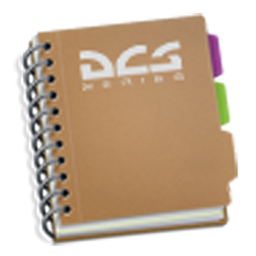
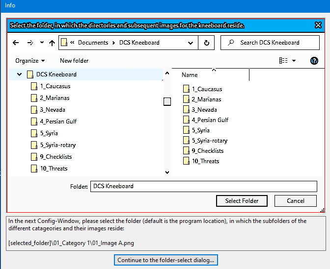
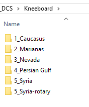
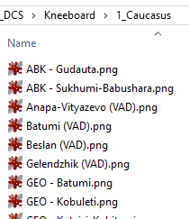

# Kneeboard Picture Viewer

For the 2D pilots out there, this program lets you navigate through your kneeboard folders and images quite quickly and easily via keyboard hotkeys!

  <a href="https://github.com/ytdlder/Kneeboard-Picture-Viewer/releases/">Download  </a> 

## Getting Started

### Dependencies

* Windows 7, 10, 11
* no installation needed
* .NET 6.0 Runtime *(if not using the rather big single EXE)*
  * [Microsoft Runtime Download](https://dotnet.microsoft.com/en-us/download/dotnet/6.0)
  * under **.NET Desktop Runtime 6.x.x**, next to **Windows**, click on your arch type (x86, x64) to download the newest runtime
  * __Direct Link__: [Latest x64 Runtime](https://aka.ms/dotnet/6.0/windowsdesktop-runtime-win-x64.exe)
* Folder/Subfolder tree with pictures as kneeboard files
  * a full folder structure with KB pages from several people can be downloaded under "Releases"
  * or here directly: 

### HowTo
After starting the program, you'll be asked to specifiy a directory with your Kneeboard folders and images inside them: 

The folder structure should look like this: 

... and the content like this: 

After that you can click through the folders and images, or use your keyboard:
* folder up/down = Ctrl + Alt + arrow Left / Right
* file up/down = Ctrl + Alt + arrow Up / Down
* first file = Shift + Ctrl + Alt + Up

You can change your colors and the font in the apps settings.

## Uninstall

* to remove the app, just delete the program folder
* to delete your settings, delete this folder: %localappdata%\Kneeboard_Picture_Viewer

## Acknowledgments

* KB pictures used are mentioned in the info-page of the app!
